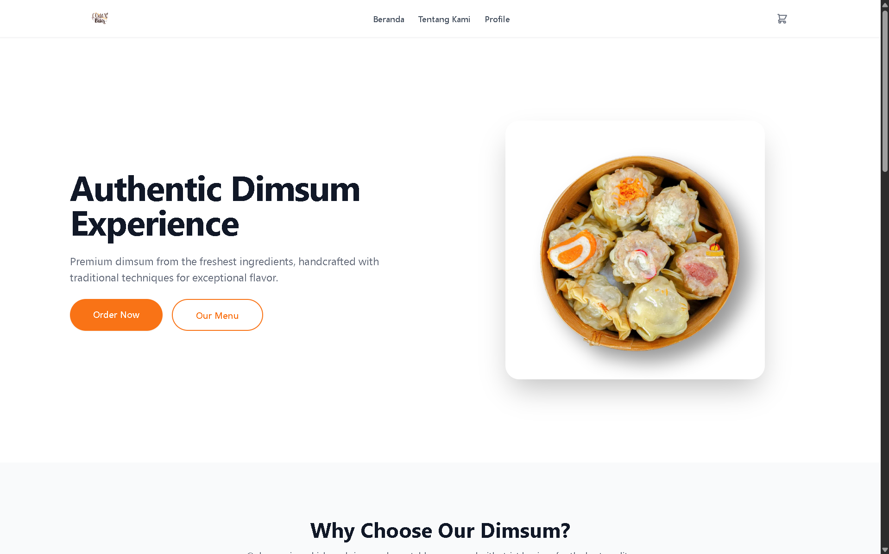
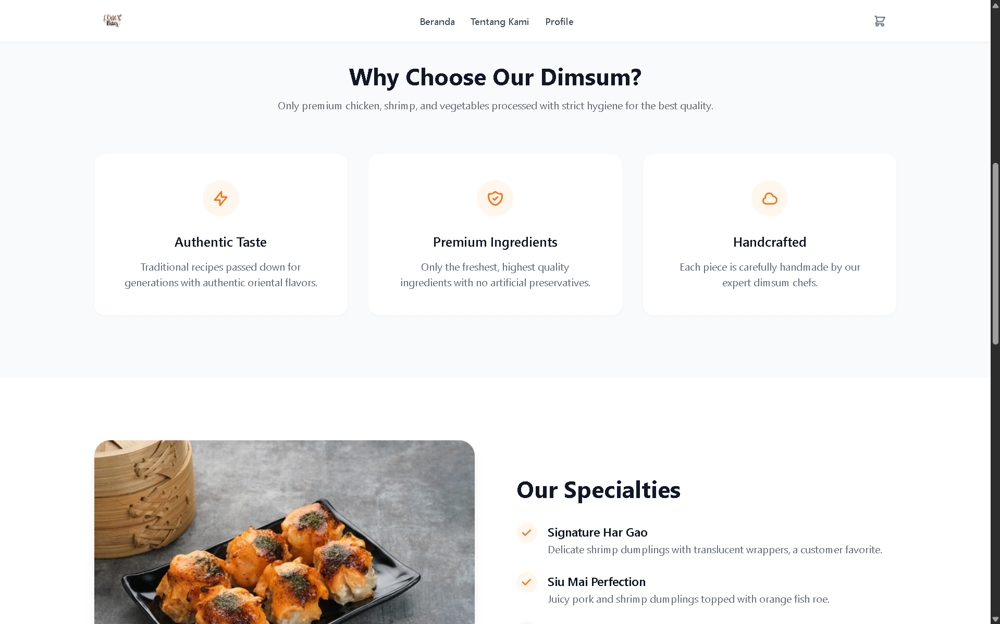
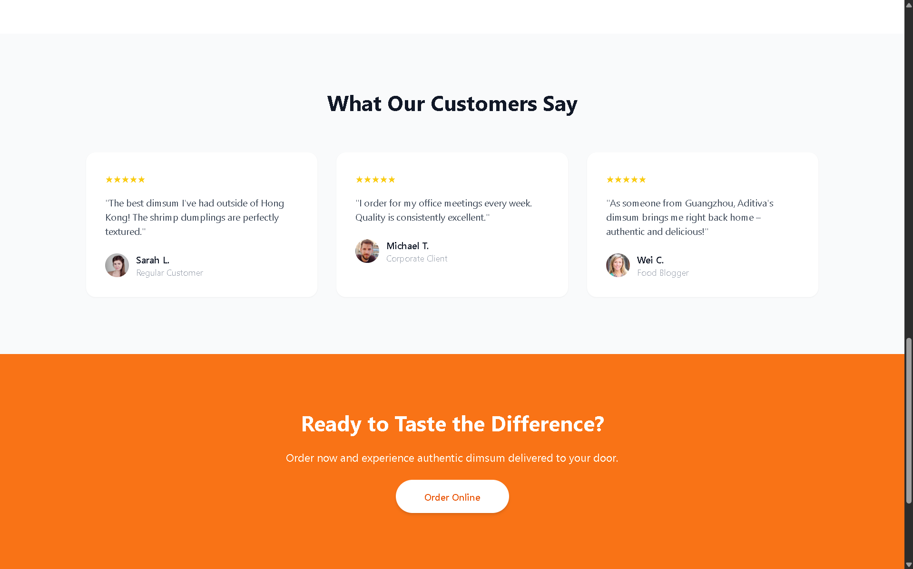
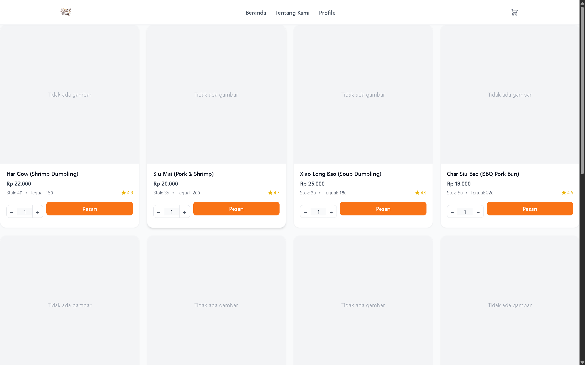
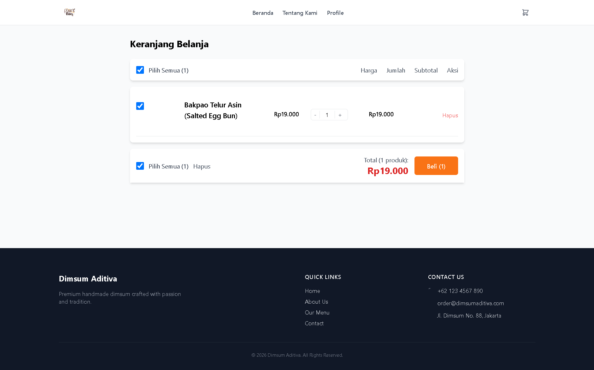

# 🥟 Authentic Dimsum - Food Ordering Web App


**Authentic Dimsum** adalah aplikasi website pemesanan makanan (e-commerce) yang dirancang khusus untuk menyajikan menu dimsum dengan pengalaman pengguna yang modern, bersih, dan responsif. Aplikasi ini memudahkan pelanggan untuk melihat menu, membaca ulasan, dan mengelola keranjang belanja mereka sebelum melakukan pemesanan.

---

## 📸 Pratinjau Antarmuka (Screenshots)

### 🏠 Halaman Utama (Landing Page)
Menampilkan daya tarik utama restoran, keunggulan produk, dan testimoni pelanggan.

| Hero Section | Why Choose Us | Testimonials |
| :---: | :---: | :---: |
|  |  |  |

### 🛒 Pemesanan & Pembelanjaan
Halaman interaktif bagi pelanggan untuk memilih menu dan mengelola total belanja.

| Halaman Menu Dimsum | Keranjang Belanja (Cart) |
| :---: | :---: |
|  |  |

---

## ✨ Fitur-Fitur Utama

### 1. 🏠 Landing Page Interaktif & Menarik
* **Hero Section**: Menampilkan visual dimsum yang menggugah selera dengan tombol Call-to-Action (CTA) yang jelas (*Order Now* & *Our Menu*).
* **Why Choose Us**: Menyoroti nilai jual utama seperti *Authentic Taste*, *Premium Ingredients*, dan *Handcrafted*.
* **Customer Testimonials**: Menampilkan ulasan pelanggan untuk membangun kepercayaan pengunjung.

### 2. 📋 Halaman Menu Produk yang Informatif
* **Grid Card Modern**: Setiap produk ditampilkan dalam kartu dengan gambar, nama, harga, stok, rating, dan jumlah terjual.
* **Rating & Stok**: Rating bintang (skala 1–5) dan indikator stok membantu pelanggan memilih produk.
* **Counter Pesanan**: Tombol `-` dan `+` yang interaktif untuk menyesuaikan jumlah pesanan langsung dari halaman menu.
* **Tombol Pesan Cepat**: Tambahkan item ke keranjang hanya dengan satu klik, tanpa harus masuk ke halaman detail.

### 3. 🛍️ Sistem Keranjang Belanja (Cart) yang Dinamis
* **Dropdown Keranjang**: Preview keranjang bisa diakses dari ikon keranjang di navbar kapan saja.
* **Halaman Keranjang**: Tampilan lengkap dengan daftar item, quantity, harga satuan, subtotal, dan opsi hapus.
* **Checkout Selektif**: Pilih item yang akan dibeli melalui checkbox, total otomatis terhitung sesuai item terpilih.
* **Login Terintegrasi**: Pengguna harus login untuk menyimpan dan mengelola keranjang (keranjang berbasis user).

### 4. 👤 Sistem Autentikasi Pengguna
* **Login & Register**: Halaman autentikasi yang bersih untuk mengakses fitur personal.
* **Profile Pengguna**: Setelah login, nama pengguna dan tautan profil muncul di navbar.
* **Keamanan Sesuai Role**: Pembatasan akses fitur keranjang dan pemesanan hanya untuk pengguna yang sudah login.

### 5. 🧭 Navigasi Modern & Responsif
* **Navbar Sticky**: Navigasi tetap terlihat saat menggulir, dengan logo, menu, dan ikon keranjang.
* **Menu Mobile (Hamburger)**: Animasi transisi yang halus untuk tampilan mobile.
* **Desain Minimalis**: Warna netral (putih/abu-abu) dengan aksen oranye yang tidak berlebihan.
* **Footer Informatif**: Memuat tautan cepat, kontak, dan ikon media sosial dengan tampilan dark mode yang elegan.

### 6. 📱 Desain Sepenuhnya Responsif & Clean UI
* **Tailwind CSS Utility-First**: Seluruh tata letak dibangun menggunakan framework Tailwind untuk konsistensi dan kemudahan kustomisasi.
* **Dua Tampilan Menu**: Kartu produk memiliki versi desktop (dengan counter & tombol pesan) dan versi mobile (dengan tombol “Lihat Detail”) untuk kenyamanan pengguna.
* **Animasi Halus**: Transisi pada hover, dropdown, dan mobile menu meningkatkan UX tanpa mengganggu.
* **Palet Warna Netral + Aksen**: Background putih/abu-abu membuat gambar produk lebih menonjol, dengan aksen oranye sebagai pemandu aksi.

---

## 🛠️ Teknologi yang Digunakan

* **Frontend**: HTML5, CSS3 (Tailwind CSS Framework), Vanilla JavaScript.
* **Backend & Database**: PHP Native & MySQL (Untuk manajemen data produk dan pesanan).
* **Desain UI/UX**: Clean & Minimalist interface dengan fokus pada *Food Photography* (White & Orange Theme).

---

## 🚀 Panduan Instalasi (Local Development)

Ikuti langkah-langkah berikut untuk menjalankan proyek ini di komputer lokal (localhost):

### 1. Simpan Project ke Web Server Lokal
Letakkan direktori proyek ini di dalam folder server lokal kamu (Laragon atau XAMPP):
* **Jika pakai Laragon**: `C:\laragon\www\nama-folder-dimsum`
* **Jika pakai XAMPP**: `C:\xampp\htdocs\nama-folder-dimsum`

### 2. Setup Database MySQL
1. Buka browser dan akses **phpMyAdmin** (`http://localhost/phpmyadmin`).
2. Buat database baru (contoh: `db_dimsum`).
3. Import file `.sql` bawaan proyek (jika ada) ke dalam database yang baru saja dibuat.
4. Sesuaikan file koneksi database (misal: `koneksi.php`) dengan kredensial localhost kamu (user: `root`, password: ``, nama database: `db_dimsum`).

### 3. Install Dependencies (Jika Menggunakan Tailwind via NPM)
Buka terminal/Command Prompt di dalam folder proyek, lalu jalankan:
```bash
# Install dependencies
npm install

# Compile Tailwind CSS (Watch mode untuk development)
npm run dev